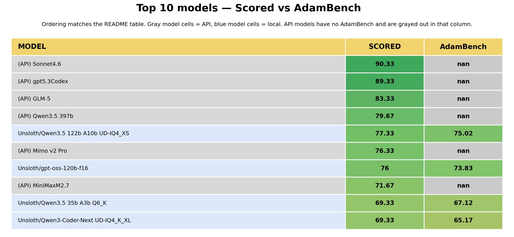
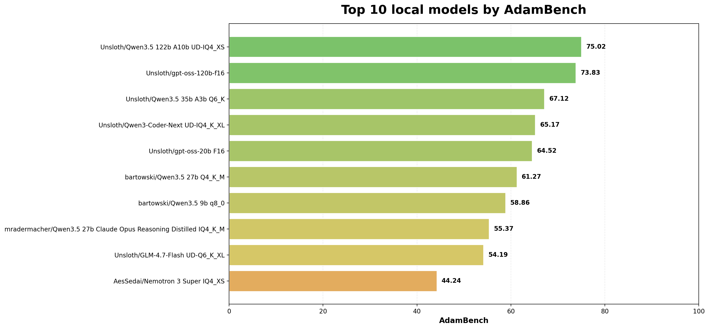
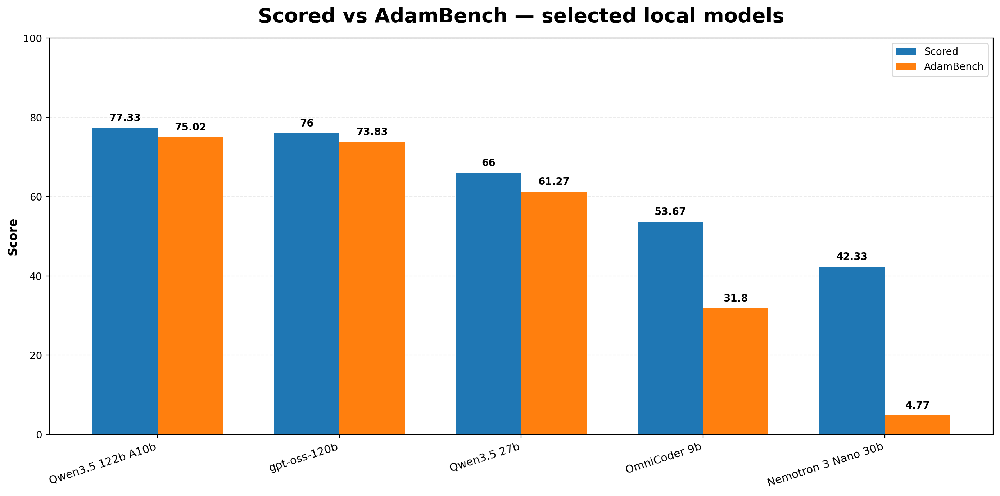
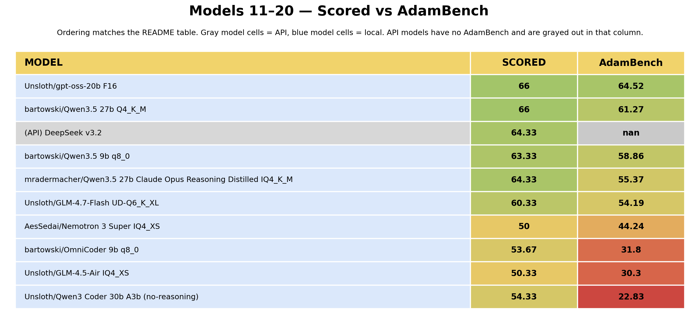
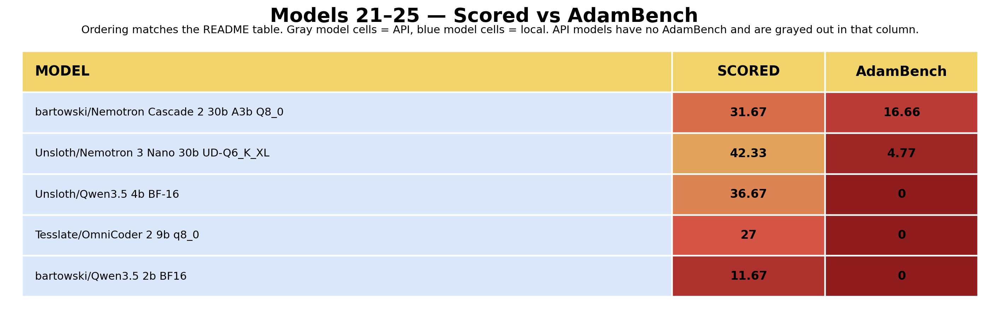
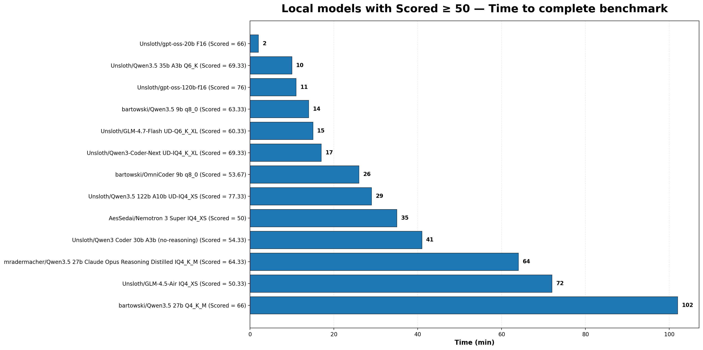

# AdamBench v1

It's a practical benchmark of local models for agentic coding. I wanted to do it to find the best local coding model for myself, so it measures performance of models on my specific hardware (RTX 5080 16Gb; 64Gb RAM DDR5; AMD 9950 x3d) and on a workflow, that resembles a typical simple agentic coding development flow. The task and metrics while structured and generally measurable, are completely subjective (because it was supposed to help me chose the best models for coding for MYSELF). However, I decided to publish it, because I believ it actually might help others find best models for themselves as well. I'm also thinking of v2 of this benchmark already, since there are a couple things that could have been done better and doing v1 was fun.
I selected different quants for different models, chosing what seemed to give the best speed vs quality value on my hardware. I also benchmarked a couple top models via API just to be able to compare the local ones with them.

The main benchmark metric "AdamBench" measures not just the quality of a given model's project, but also confronts it with the amount of iterations the model needed to perform a benchmark and the time required for it. So I'd call it a general practical usage scale in local agentic coding (on my specific hardware).

[FULL RESULTS HERE](#full-results)

## Key takeaways

- The TOP 1 winner of the main benchmark metric (AdamBench) is Qwen3.5 122b A10b
- If you're looking for a smaller model though, the TOP 3 of all tested local models was achieved by Qwen3.5 35b A3b
- And if 35b is still too big, Qwen3.5 9b scored an astonishing TOP 7, outperforming many way bigger models.
- The biggest positive surprise for me was the performance of gpt-oss-120b (TOP 2) and gpt-oss-20b (TOP 5). They both scored pretty well, but most importantly they are super fast for their sizes and at the same time they waste way less tokens than other models to perform a task.
- The biggest disappointment for me were Nemotron models, that performed quite bad quality-wise, they were slow and they generated unreasonable amount of tokens (that were mostly reasoning). Nemotron 3 Super, the highest rated model from this familiy ended at TOP 10 spot, outperformed even at bare quality metrics by much smaller models.


Initially I had 25 local models, that I wanted to benchmark (including the ones that were released after I started tests), however the benchmark only includes 20 of them. Models that are not included in the benchmark are:
- Mistral Small 4
- Qwen2.5 Coder 32b 
- DeepSeek Coder v2 Lite Instruct
- Pluto 9b
- Devstral Small 2 24b Instruct
I tried running all of them, but each of them had issues with tool calling or chat template, which was making them unusable for local agentic coding. In case of Mistral Small 4 I even spent a couple days trying to make it reasonably work... without success. So while I don't include them in the benchmark's score, it's safe to assume they are BELOW any models present in the benchmark, because they are unusable without some shenanigans (I assume it is possbile to use them eventually, but the effort required to make them work is probably not worth it. Especially comparing to all other 20 models, that didn't have any problems with my environment setup).

### TOP 10 overall (including API models) by Score and AdamBench

`Scored` is a general quality metrics, while `AdamBench` confronts it with number of iterations and time for performing the whole benchmark.

<p align="center">
  
</p>

### TOP 10 AdamBench

<p align="center">
  
</p>

### Scored vs AdamBench

`AdamBench` is especially punishing for models, that were not able to complete all 5 banchmark tasks or for those that needed many iterations or a lot of time.

<p align="center">
  
</p>

---
## Methodology

This benchmark was designed as a practical evaluation of local and API coding models for small-scale agentic software engineering, with a focus on workflows that are realistic for day-to-day local use on a single workstation. The primary goal was not to produce a scientifically rigorous or universally generalizable ranking of all coding models, but rather to identify which models work well in this specific setup, under the kinds of iterative debugging and feature-development loops that are common in personal use.

### Benchmark objective

The benchmark was intended to evaluate how well different models can handle a short multi-step coding workflow involving:

- initial project scaffolding,
- feature implementation,
- refactoring,
- iterative repair of self-introduced bugs,
- and simplification of overengineered solutions.

The target use case was a small React + TypeScript application developed incrementally across several prompts. The workflow emphasized not only raw code generation quality, but also the model’s ability to recover from mistakes and continue working coherently on its own earlier output. Also it was supposed to measure how well the models work with a minimal input from user. I never directed them to the root cause of the issue (if they intoduced a bug), only describing symptoms to them. The tasks the models had to perform were relatively simple, so this benchmark does not measure the ceiling of a given model's abilities and is not supposed to define "the best model overall", but as mentioned earlier "the best model for local agentic coding with my specific hardware setup".

### Prompts

The benchmark consisted of 5 prompts, always the same for every model AND potential in-between prompts, if the model introduced a bug or if something wasn't working as required. All additional iterations however were measured and they influence the `AdamBench` score.

**Prompt 1**

```
Create a React + Typescript app.

Requirements:
- login page
- dashboard page
- fake authentication
- protected routes

Use good project structure.
```

**Prompt 2**

```Refactor the authentication logic to make it more modular and testable.```

**Prompt 3**

```Add user profile page with editable name and email.```

**Prompt 4**

```
Add a new page accessible for unauthenticated users.
The page should contain a simple snake game.
Requirements:
- A minimal amount of code for the game
- Simplest possible, but human-readable visuals
- There has to be rules and controls for the game written in this page
```

**Prompt 5**

```Simplify the project structure and remove unnecessary complexity.```

### Execution environment

All the models were tested on exactly the same hardware and in the same general interference setup:
- Hardware setup: RTX 5080 16Gb, 64Gb RAM DDR5, AMD 9950 x3d
- Same context for all models: //TODO
- All model's kv cache quantized to q8_0, with exception for models with 9b parameters or smaller, since due to their size, they don't realistically need kv cache quantization in practice.
- All local models were served through `llama-server` (llama.cpp) and accessed via LAN from another computer. Nothing else than system was running on the server PC to keep the generation speed as good as possible.
- The same `llama-server` flags and sampling settings were used for all models except:
    - Models that required special flags to function correctly
    - Nemotron-family models, that required specific temperature/min_p to properly work with tool calling. (other models worked fine with default sampling settings, but Nemotron just had problems with tool calling without temperature adjustment)

The base `llama-server` command used:

```
.\llama-server.exe -m <MODEL_PATH> --host 0.0.0.0 --port 8080 -c 32768 -ngl auto --metrics --perf -np 1 -fa on -ctk q8_0 -ctv q8_0 --jinja --context-shift -fit on -fitt 512
```

### Model interaction setup

Local models were tested through an agentic coding interface in a tool-using workflow, specifically `pi-coding-agent` with it's base, bare configuration. API models were tested in an equivalent benchmark flow, but due to differences in provider environments and available runtime instrumentation, not all runtime-related metrics were equally comparable between local and API models.

The benchmark was performed as a single-run evaluation per model. Each model was given one attempt to complete the prompt chain. If the generated project was broken at any stage, the model was allowed to iterate by receiving feedback based on the observed failure.

### Iteration policy

A key part of the benchmark was measuring how reliably a model could move through the task chain without introducing bugs that required repair.

If a project failed after a prompt, the model was given another chance by describing the observed problem, for example:

- build errors,
- runtime errors,
- browser console errors,
- incorrect routing/auth behavior,
- broken UI functionality.

However, the models were never given a root cause of the bug and were never directed to specific files or parts of code. They were only given the easly observable symptoms. They weren't also given any suggestions about solutions, but I stayed cooperative. If the model included some console.logs and asked me to paste it the output, I did it.
These additional repair attempts were counted as extra iterations and affect `AdamBench` score.

The benchmark therefore rewarded not only raw generation quality, but also:

- first-pass correctness,
- stability of generated code,
- and the ability to debug self-introduced issues.

At the same time, models were not allowed to loop indefinitely. When a model showed clear signs of being stuck or repeatedly failing to repair the same issue, the run was stopped and marked as failed at the corresponding task.

### Evaluation process

The final projects were reviewed by multiple stronger reviewer models (GPT-5.4, Sonnet4.6 and GLM-5) rather than being scored manually. The prompts used for review process can be found under /review_outputs/reviewerPrompts.md.

Each reviewed project was anonymized and assessed based on:

- task completion,
- correctness,
- code quality,
- architecture / maintainability,
- simplicity vs overengineering,
- overall project quality.

Reviewers were instructed to evaluate only the final project state and benchmark completion status, rather than token efficiency or speed metrics. Their scores were aggregated into a composite project quality score `Scored` as an average of the reviewers score.

This review-based score was then combined with additional practical signals such as:

- number of completed tasks -> the earlier a model failed, the bigger the impact on it's score
- number of iterations -> each additional iteration has bigger impact than the previous one
- execution time (specifically generation time measured by output tokens and average generation TPS) -> the bigger the quality score, the smaller the negative impact of execution time, with an assumption, that I can wait a bit longer for a much better result

to derive more practical benchmark scores such as `AdamBench`.

The formulas:

**Scored**

If `r1`, `r2`, and `r3` are the three reviewer scores, then:

`Scored = round((r1 + r2 + r3) / 3, 2)`

**Measured** (which is a sub-part of `AdamBench`)

Let:

- `S` = `Scored`
- `T` = number of completed tasks, where `T` can be `0, 1, 2, 3, 4, or 5`
- `I` = number of iterations

Define the completion multiplier `m(T)` as:

- if `T = 0` then `m(T) = 0`
- if `T = 1` then `m(T) = 0.2`
- if `T = 2` then `m(T) = 0.4`
- if `T = 3` then `m(T) = 0.65`
- if `T = 4` then `m(T) = 0.85`
- if `T = 5` then `m(T) = 1`

Then:

`Measured = round(max(0, S * m(T) - 0.35 * max(0, I - 5)^1.25), 2)`

**AdamBench**

Let:

- `M` = `Measured`
- `t` = benchmark completion time in minutes (where `t = (output_tokens / mean_decode_tps) / 60`)

Then:

`AdamBench = round(max(0, M - 3 * max(0.15, 1 - M / 100) * ln(1 + t)), 2)`


### Metrics collected

The benchmark tracked several categories of data.

Quality-oriented metrics:
- reviewer-based project quality score
- benchmark completion status
- number of successfully completed tasks
Reliability-oriented metrics:
- number of total iterations
- whether the model recovered from introduced bugs
- whether the benchmark was completed or where it failed
Runtime-oriented metrics:
- approximate generation speed (TPS)
- output token count
- input token count
- approximate execution time for the benchmark (specifically generation time, not the time of the whole process)

### Methodology caveats

This benchmark should be interpreted as a practical single-run benchmark, not as a statistically rigorous scientific evaluation.

Several factors reduce strict repeatability:

**Single-run variance**

Each model was evaluated in a single main run. As a result, scores were partly sensitive to whether the model happened to introduce a major bug early in the workflow. A stronger model could score lower than expected if it created an early issue and then struggled to recover from it.

**Self-repair was heavily tested**

In many cases, the benchmark became a test not only of feature generation, but of a model’s ability to repair its own prior mistakes. This is relevant to real-world use, but it also means results partially reflect debugging resilience rather than pure one-shot coding ability.

**Optional tests introduced asymmetry**

Some models proactively added tests during the “make authentication more testable” step, even though tests were not explicitly required. If those tests failed, additional iterations were needed to repair them. Models that did not add tests were not exposed to the same failure mode. This introduces some asymmetry in iteration counts.

**Prompt 4 (Snake) was a strong differentiator**

The Snake task created a disproportionately large number of failures, regressions, and repair loops. This made it one of the strongest differentiators in the benchmark.

**Authentication and routing bugs were another major failure mode**

A recurring class of failures involved persistent authentication, protected routes, redirects, and routing state. Some models were able to implement these correctly immediately; others created subtle bugs that were difficult to repair.

**The benchmark is tuned to one specific workflow**

This benchmark reflects:

- one hardware setup,
- one inference stack,
- one prompt sequence,
- one interaction style,
- and one practical definition of success.

It is best interpreted as a strong reference point for similar local agentic coding workflows, not as a universal leaderboard.

**Sampling settings weren't suited for specific models**

To make the benchmark more reliable sampling settings should be tuned better. Either very low temp for each model OR the sampling settings recommended by the model creator.

---

## Full results

The full results table with all collected metrics for local and API models. It doesn't include separate review scores from different reviewers or categories, but these can be found under `/review_outputs`. The table is sorted by `AdamBench` score:

| Model | AdamBench | Scored | Completed | Iterations | TPS | Input tokens | Output tokens | Time (min) |
|---|---:|---:|---:|---:|---:|---:|---:|---:|
| (API) Sonnet4.6 | - | 90.33 | 5 | 5 |  | 6.4m | 71k |  |
| (API) gpt5.3Codex | - | 89.33 | 5 | 5 |  | 590k | 22k |  |
| (API) GLM-5 | - | 83.33 | 5 | 5 |  | 1.7m | 35k |  |
| (API) Qwen3.5 397b | - | 79.67 | 5 | 5 |  | 2.3m | 33k |  |
| Unsloth/Qwen3.5 122b A10b UD-IQ4_XS | 75.02 | 77.33 | 5 | 5 | 24 | 2.7m | 42k | 29 |
| (API) Mimo v2 Pro | - | 76.33 | 5 | 7 |  | 860k | 31k |  |
| Unsloth/gpt-oss-120b-f16 | 73.83 | 76 | 5 | 6 | 30 | 855k | 19k | 11 |
| (API) MiniMaxM2.7 | - | 71.67 | 5 | 5 |  | 1.6m | 35k |  |
| Unsloth/Qwen3.5 35b A3b Q6_K | 67.12 | 69.33 | 5 | 5 | 68 | 2.2m | 40k | 10 |
| Unsloth/Qwen3-Coder-Next UD-IQ4_K_XL | 65.17 | 69.33 | 5 | 8 | 48 | 3.5m | 49k | 17 |
| Unsloth/gpt-oss-20b F16 | 64.52 | 66 | 5 | 6 | 170 | 800k | 18k | 2 |
| bartowski/Qwen3.5 27b Q4_K_M | 61.27 | 66 | 5 | 5 | 6.5 | 2.8m | 40k | 102 |
| (API) DeepSeek v3.2 | - | 64.33 | 5 | 5 |  | 14.1m | 98k |  |
| bartowski/Qwen3.5 9b q8_0 | 58.86 | 63.33 | 5 | 8 | 80 | 2.5m | 68k | 14 |
| mradermacher/Qwen3.5 27b Claude Opus Reasoning Distilled IQ4_K_M | 55.37 | 64.33 | 5 | 12 | 14 | 2m | 54k | 64 |
| Unsloth/GLM-4.7-Flash UD-Q6_K_XL | 54.19 | 60.33 | 5 | 10 | 46 | 2.7m | 41k | 15 |
| AesSedai/Nemotron 3 Super IQ4_XS | 44.24 | 50 | 5 | 6 | 18 | 960k | 38k | 35 |
| bartowski/OmniCoder 9b q8_0 | 31.8 | 53.67 | 5 | 26 | 85 | 7m | 132k | 26 |
| Unsloth/GLM-4.5-Air IQ4_XS | 30.3 | 50.33 | 5 | 22 | 16 | 3.3m | 69k | 72 |
| Unsloth/Qwen3 Coder 30b A3b (no-reasoning) | 22.83 | 54.33 | 3 | 13 | 27 | 2.2m | 66k | 41 |
| bartowski/Nemotron Cascade 2 30b A3b Q8_0 | 16.66 | 31.67 | 5 | 15 | 50 | 2.3m | 150k | 50 |
| Unsloth/Nemotron 3 Nano 30b UD-Q6_K_XL | 4.77 | 42.33 | 3 | 21 | 51 | 2.9m | 300k | 98 |
| Unsloth/Qwen3.5 4b BF-16 | 0 | 36.67 | 1 | 5 | 85 | 8m | 154k | 30 |
| Tesslate/OmniCoder 2 9b q8_0 | 0 | 27 | 2 | 14 | 80 | 2m | 65k | 13 |
| bartowski/Qwen3.5 2b BF16 | 0 | 11.67 | 0 | 6 |  | 2.2m | 29k |  |


### AdamBench visualisation

<p align="center">
  
</p>

<p align="center">
  
</p>

<p align="center">
  
</p>


### Time of local models with Scored over 50

So I think this metric is quite interesting and might help to decide what model to use. This visualisation includes local models, that scored at least 50 in `Scored` value and shows the difference in time of generation required for the whole benchmark.

<p align="center">
  
</p>

---

## Interpretation and Personal notes

So this one's gonna be less professional :D
What can easly be seen in the benchmark results:
- Qwen3.5 family (and actually Qwen3 too!) is very strong... and I totally expected this.
- Nemotron family is very weak and I did not expect that. However, I did a test with Nemotron over API, just to see if it's the issue with my quant or whatever other local reason. It's not. Over API Nemotron wasn't better.
- GLM family is nice, good medium-level models.
- Fine-tunes of Qwen... did worse than base models. It was especially surirpsing to me in the case of OmniCoder. I must say, that the general feel of OmniCoder is amazing for it's size and I think it could do much better IF I did a couple runs of the benchmark for every model. This one's worth exploring more.
- GPT-OSS family was a surprise for me. I didn't expect it to be this good. First of all they waste very little tokens. Their input/output tokens value is way lower than for other models. And on top of that they are very fast (120b wich gave me 30tps in comparison to other similar size models -> 25tps for Qwen3.5 122b and 18tps for Nemotron 3 Super). 
- GPT-5.3 Codex and Sonnet4.6 over API obviously make a difference. BUT I didn't expect my local models to come this close to GLM-5 or Qwen3.5 397b and I didn't expect that some of them can even SURPASS MiMo v2 Pro or MiniMax M2.7 (and DeepSeek v3.2, but it didn't do too well, did it? xd)
- Running models smaller than 9b doesn't make sense for agentic coding. They just... fail.

So, `AdamBench` is one thing, but I wanted to share what I got for myself from this benchmark. Because while `AdamBench` seems like a nice overall metrics, it might not reflect my final personal choices:

TOP 1 daily driver for me: Qwen3.5 35b A3b (nice speed and good quality and leaves more space for longer context if needed due to it's size)

For more complex tasks: Qwen3.5 122b A10b definitely and gpt-oss-120b is something to consider too because it's much faster (due to TPS and better tokens management)

For simple tasks/fast iterations: I wanted to put Qwen3.5 9b or OmniCoder 9b, but... after thinking about it I believe that gpt-oss-20b is the best choice for me here. It's incredibly fast (170 tps generation, sic!), has superb tokens managment and just performs well. 

So if I had to leave just three models for myself from all the local ones I tested, it would be:
- Qwen3.5 35b A3b
- Qwen3.5 122b A10b
- gpt-oss-20b


And on another note, I never want to touch Nemotron again, it's crazy inefficient (looking at you Nemotron 3 Nano with a holy 300k output tokens, that were mostly reasoning, without being able to fix Snake).


This benchmark was a ride, I must say, took me way longer than I expected, especially as after I started it, a couple models were released and I had to add them too.
I started the benchmark with `Aider` with an assumption that it's probably the most "bare" tool, but many models had problems with returning properly formatted files to Aider, so I started looking for a better tool. And... it's good, because actually I realised, that I would never use Aider for local coding so it doesn't really help me at the core goal of this benchmark. I went through a couple tools and decided to use `pi-coding-agent` because it has a minimalistic, but clean UI and is reasonably "bare" in comparison to eg. `OpenCode`.
I also spent a couple days trying to make Mistral Small 4 work for me, I even built my own proxy to transform requests of Aider/pi before forwarding them to llama-server (without success xD). But thanks to it, I also found out that my llama.cpp build has some issues, so I spent some additional time fixing it (but it's good, since the issues were pretty random, most models worked normally, I thought it's because of a dysfunction in a specific quant. So now I at least have a properly working llama.cpp).

I want to do a v2 version of `AdamBench` after some break. It was quite a tiring, but also very enjoyable experience. In the next version I plan to add more tasks (eg. resolving a pre-existing bug, not only a self-added bug, I feel like the current version punishes some models too much due to a random bug they added). I also want to do a couple runs per model to make the score more reliable. And also I want to add some automation to it, because no way I'm gonna manually do a couple runs per model :P. Stay tuned.

I'm also open to suggestions about models to test, I can even add them to v1 version since I already have the whole flow ready. The only requirements are:
- The model has to support tool calling
- And it has to be able to run on my hardware (16Gb vRAM + 64Gb RAM) in a reasonable quant (So at least Q4 I guess, I didn't want to go below it for the benchmark)

And I'm open to suggestions of how I can improve the benchmark in v2 (if it happens).


## Projects deanonymized

So obviously the projects were anonymized (at least on the highest level) to avoid any bias the reviewers could have. I included all projects in the repo, so if you're curious about specific solutions of each model, here comes a list of models assigned to each project number:

1 -	Qwen35bA3bQ6K
2 - Qwen27bQ4KM
3 - Qwen122bA10bUDIQ4XS
4 - Nemotron3SuperIQ4XS
5 - GLM45AirIQ4XS
6 - gptoss120b
7 - Qwen2b
8 - Qwen27bClaude
9 - GLM-4.7-Flash
10 - Nemotron3Nano30b
11 - QwenCoderNext
12 - gpt-oss-20b
13 - OmniCoder
14 - Qwen4b
15 - Qwen9b
16 - gpt5.3Codex - API
17 - NemotronCascade2
18 - GLM-5 - API
19 - Qwen3Coder30b
20 - DeepSeek v3.2 - API
21 - OmniCoder 2
22 - Qwen3.5 397b - API
23 - Sonnet4.6 - API
24 - Mimo v2 Pro - API
25 - MiniMaxM2.7 - API